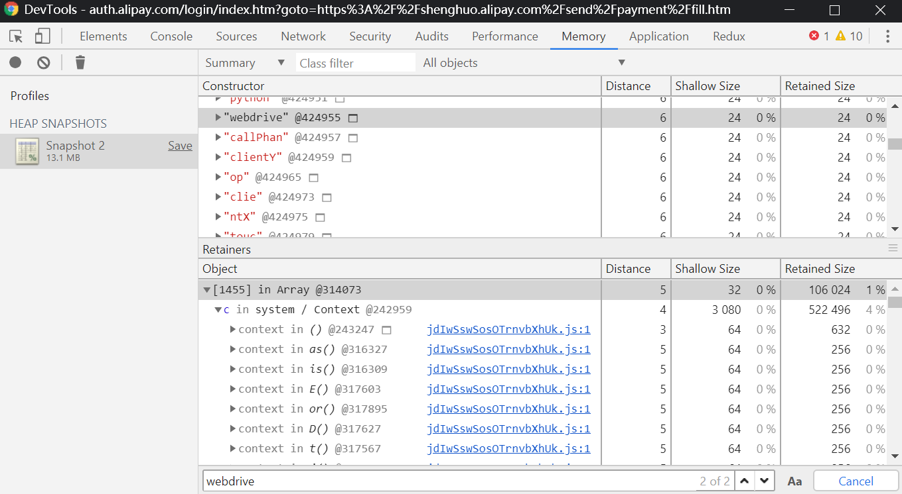

我这里想要实现的是通过转账到支付宝的方式判断一个手机号是否注册过支付宝。但查询收款人的网络请求很复杂分析不出来，使用 puppteer 也是没有解决 “操作频繁” 的问题（应该还有很多其他的判断我没有考虑到），这里只是整理记录一下。

# 问题分析

转账时查询用户是否存在会报 “操作频繁”


感觉可能检查了无头浏览器，但在 JS 里没有搜索到`webdrive`。然后通过内存快照找找发现真有`webdrive`。。（虽然不能百分百确定无头浏览器，但之后进行了一些欺骗确实有点作用）



# 尝试解决

用根据 [It is *not* possible to detect and block Chrome headless](https://intoli.com/blog/not-possible-to-block-chrome-headless/) 进行欺骗：（加了一条页面是否隐藏，感觉这个也可能会检测）

```js
// We'll use Puppeteer is our browser automation framework.
const puppeteer = require('puppeteer');

// This is where we'll put the code to get around the tests.
const preparePageForTests = async (page) => {
  // Pass the User-Agent Test.
  const userAgent = 'Mozilla/5.0 (X11; Linux x86_64)' +
    'AppleWebKit/537.36 (KHTML, like Gecko) Chrome/64.0.3282.39 Safari/537.36';
  await page.setUserAgent(userAgent);

  // Pass the Webdriver Test.
  await page.evaluateOnNewDocument(() => {
    Object.defineProperty(navigator, 'webdriver', {
      get: () => false,
    });
  });

  // Pass the Chrome Test.
  await page.evaluateOnNewDocument(() => {
    // We can mock this in as much depth as we need for the test.
    window.navigator.chrome = {
      runtime: {},
      // etc.
    };
  });

  // Pass the Permissions Test.
  await page.evaluateOnNewDocument(() => {
    const originalQuery = window.navigator.permissions.query;
    return window.navigator.permissions.query = (parameters) => (
      parameters.name === 'notifications' ?
        Promise.resolve({ state: Notification.permission }) :
        originalQuery(parameters)
    );
  });

  // Pass the Plugins Length Test.
  await page.evaluateOnNewDocument(() => {
    // Overwrite the `plugins` property to use a custom getter.
    Object.defineProperty(navigator, 'plugins', {
      // This just needs to have `length > 0` for the current test,
      // but we could mock the plugins too if necessary.
      get: () => [1, 2, 3, 4, 5],
    });
  });

  // Pass the Languages Test.
  await page.evaluateOnNewDocument(() => {
    // Overwrite the `plugins` property to use a custom getter.
    Object.defineProperty(navigator, 'languages', {
      get: () => ['zh-CN', 'zh', 'en'],
    });
  });
    
  // 可能会检测页面是否隐藏，处理一下
  await page.evaluateOnNewDocument(() => {
    // Overwrite the `hidden` property
    Object.defineProperty(document, "hidden", {
      get: () => false
    });
    Object.defineProperty(document, "webkitHidden", {
      get: () => false
    });
  });
}

(async () => {
  // Launch the browser in headless mode and set up a page.
  const browser = await puppeteer.launch({
    args: ['--no-sandbox'],
    headless: true,
  });
  const page = await browser.newPage();

  // Prepare for the tests (not yet implemented).
  await preparePageForTests(page);

  // Navigate to the page that will perform the tests.
  const testUrl = 'https://intoli.com/blog/' +
    'not-possible-to-block-chrome-headless/chrome-headless-test.html';
  await page.goto(testUrl);

  // Save a screenshot of the results.
  await page.screenshot({path: 'headless-test-result.png'});

  // Clean up.
  await browser.close()
})();
```

其他博客有说用下面这种方式去掉`webdriver`，但我测试不好使：

```js
const browser = await puppeteer.launch({ignoreDefaultArgs: ["--enable-automation"]});
```

PS：到这里问题没有完全解决，查询一两次就频繁了。最后使用 appium 操作支付宝的 APP 实现的（这种方式也有问题，因为用户可以设置不让通过手机号查找）。。

# 拓展

## `navigator.webdriver`属性

> 有兴趣的可以看看 Chrome 添加该属性的缘由：<https://groups.google.com/a/chromium.org/forum/#!msg/blink-dev/6GysDZCWwB8/rXbGoRohBgAJ>
>
> 可以根据[ChromeStatus](https://www.chromestatus.com/feature/6216034532982784)得知该属性添加的版本为 63，但这属性需要到在 puppeteer v0.12.0（对应 chromium 版本为 64.0.3240.0 (r508693)）中才开始有效，在 v0.11.0 (63.0.3205.0 (r499413)) 中还未生效。
>
> 参见：[puppeteer 的 PDD 反爬经历 - xzysaber - 博客园](https://www.cnblogs.com/xzysaber/p/9719493.html)

## 通过内存快照可以找到任何混淆过的字符串么？

并不能，必须待查找的内存没有释放（还有指向这个字符串的引用）才能找到。例如：

检测不到：

```html
<!DOCTYPE html>
<html lang="en">
  <head>
    <meta charset="UTF-8" />
    <meta name="viewport" content="width=device-width, initial-scale=1.0" />
    <meta http-equiv="X-UA-Compatible" content="ie=edge" />
    <title>Document</title>
  </head>
  <body>
    <script>
      (function test() {
        var fun_a = "\167\145\142\144\162\151\166\145\162";
      })();

      ("\167\145\142\144\162\151\166\145\162");

      var a = navigator["\167\145\142\144\162\151\166\145\162"];
      console.log(a);

      var window.b = "\167\145\142\144\162\151\166\145\162";
      delete window.b;
    </script>
  </body>
</html>
```

可以检测到：

```html
<!DOCTYPE html>
<html lang="en">
  <head>
    <meta charset="UTF-8" />
    <meta name="viewport" content="width=device-width, initial-scale=1.0" />
    <meta http-equiv="X-UA-Compatible" content="ie=edge" />
    <title>Document</title>
  </head>
  <body>
    <script>
      var a = "\167\145\142\144\162\151\166\145\162";

      function test() {
        var fun_a = "\167\145\142\144\162\151\166\145\162";
        return navigator[fun_a];
      }
      var b = test();

      //> [...'webdriver'].map((d, i)=>String.fromCharCode(d.charCodeAt(0) + 1)).join('')
      //'xfcesjwfs'
      var other_1 = [..."xfcesjwfs"]
        .map((d, i) => String.fromCharCode(d.charCodeAt(0) - 1))
        .join("");
    </script>
  </body>
</html>
```
