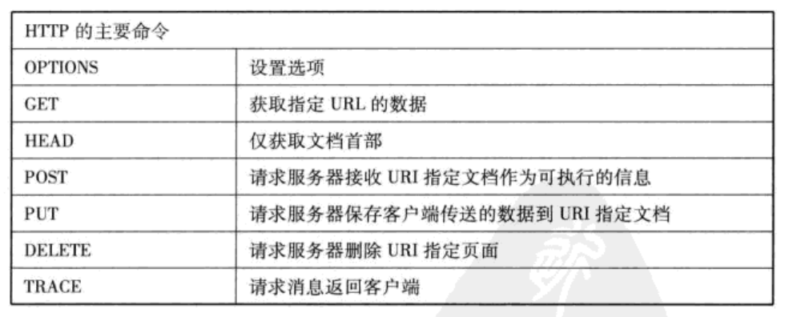
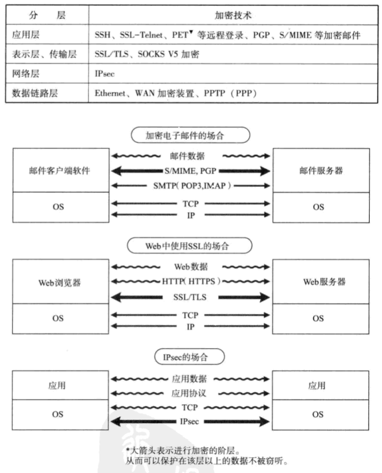
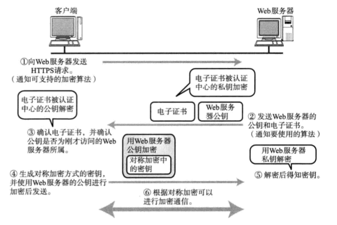

# 第一章 网络基础知识

计算机网络根据规模可以分为：广域网（WAN: Wide Area Network）和局域网（LAN: Local Area Network）

协议的标准化：

-   国际标准化组织（ISO: International Organization for Standards）制定了一个国际标准开放式通信系统互联参考模型（OSI: Open Systems Interconnection），对通信系统进行了标准化
-   TCP/IP 通信协议是由 IETF（Internet Engineering Task Force） 所建议的一种协议

OSI 将通信分为 7 层，上下层之间交互遵循的约定叫 “接口”，同一层之间遵循的约定叫 “协议”。

OSI 仅是一个模型，定义了各层的作用，并没有对接口和协议进行详细的定义。

## OSI 参考模型各层作用

-   7 应用层：针对特定应用的协议，如：电子邮件、远程登录、文件传输等
-   6 表示层：设备固有数据格式和网络标准传输格式的转换，如：统一传输过程的文字、图片、声音的编码等
-   5 会话层：控制连接、数据分割，如：建立断开连接、规定连接保持多久
-   4 传输层：确保数据可靠传输（这层在通信双发节点处理无需再路由器上处理），如：当数据丢失告知源主机重新发送
-   3 网络层：将数据传输到目标地址（目标地址可以是多个网路通过路由器连接而形成的某一个地址），如：进行地址管理与路由选择
-   2 数据链路层：传输介质互连的设备间的数据处理，如：将 0,1 数据划分为有意义的数据帧，传输和识别数据帧
-   1 物理层：0,1 数据与电压和脉冲光的互换

## 传输方式分类

连接类型：有连接、无连接

通信方式：电路交换、分组交换

接收端数量：单播（Unicast）、广播（Broadcast）、多播（Muticast）、任播（Anycast）

## 地址

在网络通信中每层协议使用的地址都不尽相同，如在 TCP/IP 中使用 MAC 地址、IP 地址、端口号等信息作为地址的标识，应用层将电子邮件地址地址等作为网络通信地址。

地址应具有唯一性、层次性

## 网络构成的要素

| 设备                  | 作用                        |
| ------------------- | ------------------------- |
| 网卡 / 网络接口卡（NIC）     | 使计算机联网（Network Interface） |
| 中继器（Repeater）       | 从物理层延长网络                  |
| 网桥（Bridge）/ 2 层交换机  | 从数据链路层延长网络                |
| 路由器（Router）/ 3 层交换机 | 通过网络层转发分组数据               |
| 4 - 7 层交换机          | 处理传输层以上各层网络传输的设备          |
| 网关（Getaway）         | 转换协议的设备                   |

# 第二章 TCP/IP 基础知识

TCP: Transmission Control Protocol

IP: Internet Protocol

很多情况下 TCP/IP 指利用 IP 通信时所用到的协议族的统称

TCP/IP 协议的特点是开放性和实用性

TCP/IP 协议由 IETF 讨论制定，需要标准化的协议被列入 RFC（Request For Comment，官网 [» RFC Editor](https://www.rfc-editor.org/)）文档并在互联网公布

互联网中的每个网络都是由骨干网和末端网组成的，每个网络之间通过 NOC（Network Operation Center） 相连。互联网是众多异构网络通过 IX（Internet Exchange）互联的一个巨型网络。

连接互联网需要向 ISP 或区域网提出申请

## TCP/IP 协议族

-   应用协议：HTTP, SMTP, FTP, TELNET, SNMP
-   传输协议：TCP, UDP
-   网际协议：IP, ICMP, ARP
-   路由控制协议：RIP, OSPF, BGP

## TCP/IP 与 OSI 参考模型

| OSI 参考模型 | TCP/IP 分层模型  |
| -------- | ------------ |
| 应用层      | 应用层          |
| 表示层      | 应用层          |
| 会话层      | 应用层          |
| 传输层      | 传输层          |
| 网络层      | 互联网层         |
| 数据链路层    | 网络通信层（网络接口层） |
| 物理层      | 网络通信层（硬件层）   |

应用层协议：

-   HTTP：客户端与服务器通信
-   SMTP：电子邮件
-   FTP：文件传输，进行文件传输会建立两个 TCP 连接，一个用于控制传输请求，另一个用于实际传输数据
-   SSH 和 TELNET：远程登录
-   SNMP：网络管理，用于管理服务器、路由和交换机

## 例：TCP/IP 通信的过程

以发送电子邮件为例

1.  发送端应用程序处理：输入电子邮件内容，然后点击发送（**应用层**），这时会进行编码（UTP-8 或 GBK 等）处理（**表示层**），然后在合适的时机建立会话和发送数据（**会话层**）
2.  发送端 TCP 模块处理：TCP 根据应用层的指示建立连接、发送数据、发送数据时会在数据前加上 TCP 首部（**传输层**）
3.  发送端 IP 模块处理：IP 将 TCP 传来的数据加上 IP 首部，然后根据路由控制表将数据发给目标路由器或主机（**网络层**）
4.  发送端网络接口（以太网驱动）的处理：接收 IP 包加上以太网首部并通过物理层发送给接收端（**数据链路层**）
5.  接收端网络接口（以太网驱动）的处理：根据首部 MAC 地址判断是否为发送给自己的包，然后根据首部的上一层协议类型（这里是 IP）将数传给处理这种协议（这里是 IP）的程序（**数据链路层**）
6.  接收端 IP 模块处理：根据首部 IP 地址判断是否为发送给自己的包，然后传给上一层（这里是 TCP）的程序（**网络层**）
7.  接收端 TCP 模块处理：数据被完整接收后会传递给端口号识别的应用程序（**传输层**）
8.  接收端应用程序处理：在合适的时机建立会话和接收电子邮件数据（**会话层**），进行编码（**表示层**），然后进行验证和展示（**应用层**）

每个包首部都至少包括：1 发送端接收端地址，2 上一层协议类型

# 第三章 数据链路

数据链路可以视为网络传输中的最小单位，可以称互联网为” 数据链路的集合 “。

## MAC 地址

MAC 地址用于识别数据链路中互连的节点，使用网卡（NIC）的情况下，MAC 地址一般会被烧入到 ROM 中。

无论哪个协议成员通信设备设计前提都是 MAC 地址唯一。

交换机自学原理：交换机从源 MAC 地址学习到主机（MAC 地址）对应的交换机的端口，并在该主机（MAC 地址）作为目标时直接通过记录的端口发送。（如果未找到记录的主机（MAC 地址）则对所有未知主机（MAC 地址）的端口发送）

环路检测：生成树协议、源路由法

VLAN：不用修改网络布线，只用修改网络配置就可以实现网段的划分。

## 以太网（Ethernet）

我们平时用的网线、光纤连接的网络

## 无线通信

使用电磁波、红外线、激光等方式进行数据传播。包括：蓝牙（PAN）、WI-FI（LAN）、3G 和 4G（WAN）等等

## PPP

点对点连接计算机的协议：Point-to-Point Protocol

## 公共网络

-   模拟电话线路：使用电话线路进行通信，需要一个将数字信号转换为模拟信号的调制解调器（“猫”）
-   FTTH（FIber To The Home）：光纤到户
-   VPN：虚拟专用网络
-   公共无线 LAN：公开使用的 Wi-Fi

# 第四章 IP 协议

IP（IPv4、IPv6）相当于 OSI 参考模型中的第 3 层网络层，网络层的主要作用是 “实现终端节点之间的通信”。

IP 大致分为三大作用模块：IP 寻址、路由、以及 IP 分包和组包。

路由控制表：为了将数据包发给目标主机，所有主机都维护着一张路由控制表（Routing Table）。该表记录 IP 数据在下一步应该发给那个路由器。

不同数据链路的最大区别是她们的最大传输单位（MTU:Maximum Transmission Unit）不同，IP 可以将这种区别抽象化。

IP 属于面向无连接型，在发包之前无需建立连接。这样一是可以简化，二是可以提速。（IP 只会尽力做好发送数据的工作，TCP 属于面向有链接型会保证通信的可靠性）

## IP 地址的基础知识

IPv4 地址由 32 位正整数表示（32bit），2^32 大约为 43 亿，IP 地址分为网络标识和主机标识，这样一算实际上能连接到网络的计算机个数不是很多。

查看 IP：

-   windows `ipconfig`
-   unix `ifconfig`

IP 地址分类：

-   A 类：IP 地址为 0 开头，前 8 位为网络标识，后 24 位为主机标识
-   B 类：IP 地址为 10 开头，前 16 位为网络标识，后 16 位为主机标识
-   C 类：IP 地址为 110 开头，前 24 位为网络标识，后 8 位为主机标识
-   D 类：IP 地址为 1110 开头，前 32 位为网络标识，没有主机标识（经常用作多播）

IP 主机标识全为 0 表示 IP 地址不可知的情况，全为 1 通常作为广播地址，在分配过程中应该去除这两种情况。

子网掩码：因为用 IP 地址分类会造成浪费且不灵活，所以人们引入了子网掩码，自定义网络标识的长度，如需要 26 位的网络标识：

```text
IP: 172.20.100.52
子网掩码: 255.255.255.192

或

172.20.100.52/26
```

私有 IP 和全局 IP：

-   私用 IP：10/8、172.16/12、192.168/16、0/8、127/8，这些 IP 可以用在局域网防止冲突
-   全局 IP（公网 IP）：其他的地址，由 ICANN（Internet Corporation for Assigned Names and Numbers）进行管理

IP 报文的分片与重组：路由器会做分片但不会重组，重组在目标主机上进行。使用路径 MTU 发现可以缓存 MTU 的值让分片只在一开始进行一次。

IPv6：长度为 IPv4 的 4 倍（128bit），16bit 为一组分成 8 组

IPv4 和 IPv6 包首部：版本、源地址、目标地址、总长度、跳数限制、片偏移、数据等

# 第五章 IP 协议相关技术

## DNS

DNS（Domain Name System）将域名装换成 IP 地址。

使用`nslookup 主机名`会返回对应的 IP 地址。

域名具有分层结构，根（.）-> 一级域名（例如：com, cn 等）-> 二级域名（例如：baidu, zjffun 等）-> 三级域名（例如：www, blog 等）。。。

DNS 查询：解析器先从自己的数据库中找域名对应的 IP，找不到就向上一层进行查找

DNS 记录类型：

| 类型    | 内容               |
| ----- | ---------------- |
| A     | 主机名的 IP 地址（IPv4） |
| CNAME | 主机别名             |
| PTR   | IP 地址反向解析        |
| 等等。。。 |                  |

## ARP

ARP（Address Resolution Protocol）通过目标 IP 定位下一个接收数据分包的网络设备对应的 MAC 地址。

RARP（Reverse Address Resolution Protocol）根据 MAC 地址定位 IP 的协议，用于打印机等小型嵌入式设备接入网络。

## ICMP

ICMP（Internet Control Message Protocol）用于网络诊断，包括确认 IP 包是否送达、通知 IP 包被废弃的原因、改善网络设置等。

显示经过的路由器：

Unix: `traceroute 目标主机地址`

Windows: `tracert 目标主机地址`

数据包是否送达成功：`ping 目标主机地址`

## DHCP

DHCP（Dynamic Host Configuration Protocol）用于自动设置 IP 地址，自动化了对接入的物理设备分配 IP 的步骤。

## NAT

NAT（Network Address Transfer）用于在本地网络使用私用地址，连接互联网时使用全局 IP 地址。

路由器让连接到她的设备在内网间使用私用地址互相通信，需要连接到互联网时通过一个 ip 访问外网。（这样只能设备主动去连接外网建立连接，外网无法主动访问这个 ip 对应的设备，因为这个 ip 会对应很多设备）。

NAPT（Network Address Ports Transfer）技术通过转换端口可以让外网主动与多个设备通信。

## IP 隧道

IP 首部后面还是 IP 首部（网络层首部后面继续追加网络层首部）的情况，主要用于让不支持 IPv6 的路由器将整个 IPv6 包作为数据发送出去。

# 第六章 TCP 与 UDP

-   传输层：处理数据发送和接收数据的去向。

-   TCP（Transmission Control Protocol）：提供顺序控制，重发控制机制，此外还有流量控制，拥塞控制、提高网络利用率等功能。

-   UDP（User Datagram Protocol）：可以确保消息的大小，但不能保证消息一定送达（应用层有时会根据自己的需要进行重发处理）。

-   套接字（socket）API：进行网络通信的 API，提供`send()`，`recv()`等接口。

-   端口号：用来区分一台计算机中的不同应用程序。

-   TCP/IP 和 UDP/IP 常用源 IP、目标 IP、协议号、源端口、目标端口这 5 个信息来识别一个通信。

## UDP

UDP 不提供复杂的控制机制，利用 IP 提供简单的无连接服务。

## TCP

TCP 是一种面向有链接的协议，只有确认通信双方存在才发送数据。

TCP 通过校验和、序列号、确认应答、重发控制、链接管理以及窗口控制等机制实现可靠的传输。

### 序列号、确认应答、重发控制

为了丢弃因为网络原因重复的数据包需要用序列号识别是否已经接收过。

TCP 中当发送端数据到达接收主机时并且数据正常，接收端主机会返回一个已接收到消息的通知，叫做 ACK（Positive Acknowledgement），数据异常会返回否请确认应答 NACK（Negative Acknowledge）。

重发后收不到应答会增加等待时间，但不会无限重发，达到一定次数后会强制关闭连接。

### 链接管理

TCP 连接建立与断开正常需要来回发 7 个包才能完成（3 次握手，4 次挥手）。

建立：

```text
客户端                         服务端

1      -- SYN（请求建立连接）-->

2    <-- ACK（针对SYN的确认应答）--
          SYN（请求建立连接）

3    -- ACK（针对SYN的确认应答）-->
```

我的一些理解：双方都要知道自己能连通对方，如果服务端接收到客户端的数据就建立连接，之后发现自己发送给客户端信息她收不到就尴尬了。

发送数据。。。

断开

```text
客户端                         服务端

4      -- FIN（请求切断连接）-->

5    <-- ACK（针对FIN的确认应答）--
6      <--FIN（请求切断连接）--

7    -- ACK（针对FIN的确认应答）-->
```

我的一些理解：因为确认切断连接后服务端可能还有一些事要处理，所以会分成两次发。

### 窗口控制

建立 TCP 连接时可以确定发送数据包的长度，成为最大消息长度 MSS（Maximum Segment Size）。

TCP 以段为单位，每发一个段进行一次确认的缺点是往返时间越长，通信性能越低。为了解决这个问题引入了窗口控制以提高速度。

窗口内的数据即使没有收到确认也可以发送出去，如果数据丢失则重发丢失的部分。（还是每个段都有确认，不过可以多个一起进行了）

## 其他传输层协议

UDP-Lite

SCTP

DCCP

## UDP 首部

源端口号、目标端口号、包长度、校验和。

## TCP 首部

源端口号、目标端口号、序列号、确认应答号、数据偏移、保留、控制位、窗口大小、校验和、紧急指针、选项、填充。

TCP 中没有表示包长度和数据长度的字段。可由 IP 层获知 TCP 的包长度，进而计算数据长度。

# 第七章 路由协议

路由器根据路由控制表（Routing Table）转发数据包。

路由控制分为静态和动态两种类型。

动态路由的相邻的路由器会发送自己已知的网络连接信息。

根据路由控制范围常使用 IGP（Interior Gateway Protocol）和 EGP（External Gateway Protocol）两种协议。（他们的关系和 IP 和的网络部分和主机部分类似）

## 路由算法

路由算法分为距离向量（Distance-Vector）算法和链路状态（Link-State）算法。

### 距离向量

路由器之间交换目标网络的方向和距离的信息，然后根据这些信息决定目标网络或主机。

### 链路状态

在了解网络整体的状态的基础上生成路由控制表的方法。

## RIP（Routing Information Protocol）

距离向量型的路由协议，广泛用于 LAN。

## OSPF（Open Shorttest Path First）

链路状态型的路由协议，即使网络有环路也可以进行稳定的路由。

## BGP（Border Gateway Protocol）

距离向量型的路由协议，属于外部网关协议，主要用于 ISP 之间连接的部分。

BGP 会根据进过的 AS（自治系统：Autonomous System）的个数进行路由控制。

## MPLS（Multi Protocol Label Switching）

如今，转发 IP 数据包除了使用路由技术，还使用标记交换机技术。标记交换机技术最具代表性的就是 MPLS。

在 MPLS 网络入口处附加标记，然后通过这个标记进行转发，在 MPLS 网络出口处将这个标记删除。

# 第八章 应用协议

-   TELNET：常用于登录路由器或者高性能交换机等网络设备进行设置。
-   SSH：加密的远程登录系统。
-   FTP：文件传输。（需要两个 TCP 连接，一个用来控制，一个用来传输数据）
-   SMTP：发送电子邮件。
-   POP：请求接收、接收电子邮件，邮件在客户端管理。
-   IMAP：也是接收电子邮件的协议，邮件在服务器管理。
-   MIME：（6 表示层）规定应用消息格式。
-   URI：Uniform Resource Identifier 用于标识任何资源。
-   URL：用于标识互联网资源。
-   HTTP：超文本传输协议



-   CGI：Common Gateway Interface，Web 服务器调用外部程序时使用的一种服务端应用规范。（一般 Web 通信返回静态信息，CGI 用来返回动态信息）
-   SNMP：网络管理。
-   H.323：音频视频传输。
-   SIP：比 H.323 简单的音频视频传输。
-   RTP：Real-Time Protocol，在 UDP 基础上为报文添加时间戳和序列号（UDP 实现多媒体通讯需要这些信息）。
-   RTCP：通过丢包率等路线质量的管理，对 RTP 的数据传输率进行控制。
-   P2P：Peer To Peer，1 对 1 通信。
-   LDAP：访问目录服务。

# 第九章 网络安全

## 构成

-   防火墙
-   IDS 入侵检测系统
-   反病毒 / 个人防火墙

## 加密技术

-   对称加密：加密和解密用相同的密钥，挑战是传递安全密钥。使用 AES、DES 等加密算法。
-   非对称加密：加密和解密用不同的密钥，加密和解密花费时间长。使用 RSA、DH、椭圆曲线等加密算法。



## 安全协议

### IPsec 与 VPN

构建 VPN 时最常用的是 IPsec。

IPsec 指在 IP 首部后追加 ESP 和 AH，从而对此后的数据加密。

### TSL/SSL 与 HTTPS

-   TSL/SSL：Transport Layer Security / Secure Sockets Layer
-   HTTPS：使用 TSL/SSL 的通信。
-   确认公钥是否正确主要使用认证中心（CA）签发的证书，主要认证中心的信息已经嵌入到浏览器的出场设置中。



### IEEE802.1X

LAN 和无线 LAN 接入的用户认证技术。

# 附录
