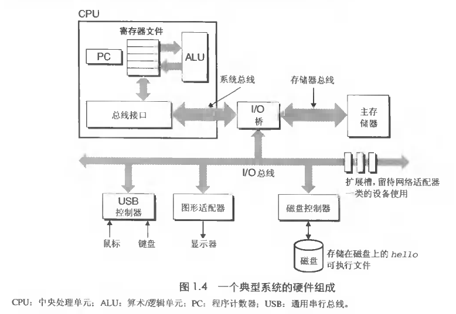
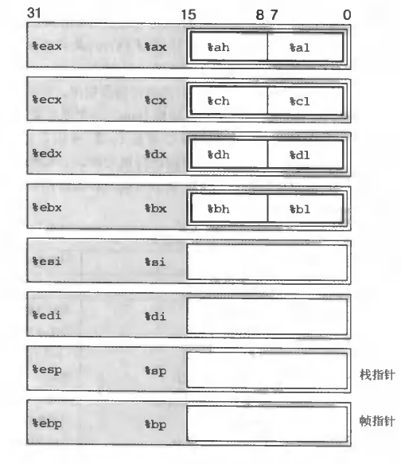
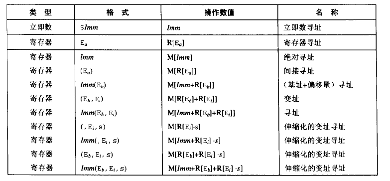
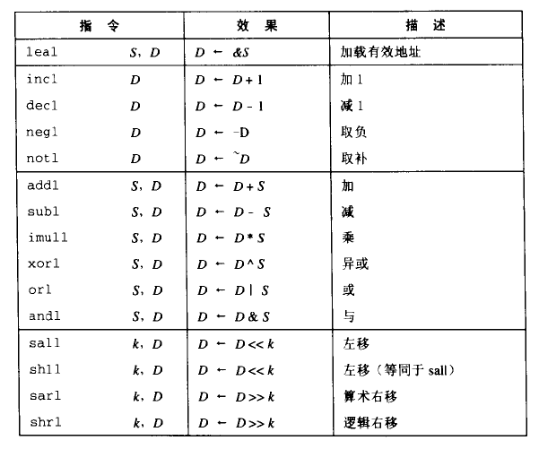
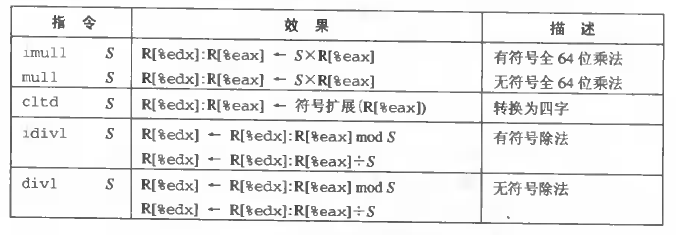
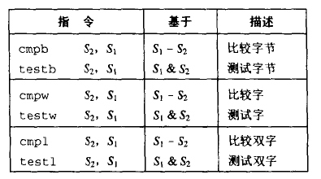
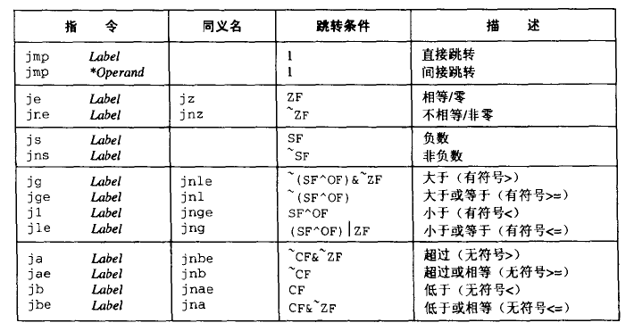
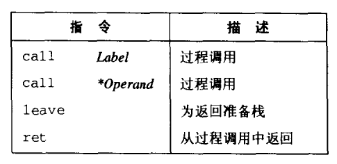
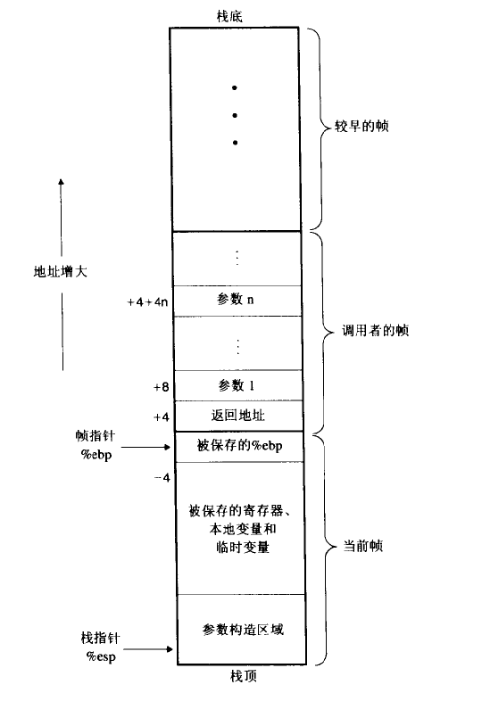
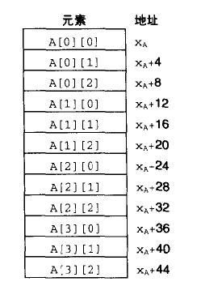

# 1 计算机系统漫游

-   计算机系统：硬件 + 软件

-   信息：位 + 上下文（用来区分不同的数据对象）
    -   上下文：用来区分不同的数据对象，如：在不同上下文中同样的字节序列可以表示整数、字符串或机器指令等。

## 程序翻译的各个阶段（编译系统）

-   预处理阶段：预处理器（cpp），根据`#`开头的命令修改原始 C 程序，如：将`incude`文件的内容插入到程序文本中。
-   编译阶段：编译器（ccl），编译为汇编语言。
-   汇编阶段：汇编器（as），翻译成机器语言，并打包成可重定位的目标程序的格式。
-   连接阶段：将用到的库中的函数加入到程序。

## 系统硬件组成



## 存储

-   高速缓存：处理器处理的快而数据传输慢，数据传输成为瓶颈，所以产生了高速缓存技术。。


## 操作系统

-   进程（Process）：给程序独立使用 CPU、主存、I/O 设备的假象。任何时刻操作系统只有一个进程在运行，进程会交错执行（并发运行）。
-   线程（Thread）：一个进程可以包含多个线程。
-   虚拟存储器：为程序提供独立使用主存的假象。
-   文件：只不过是字节序列，磁盘、键盘、显示器。甚至网络都可看做文件，系统的输入输出都可以看做系统函数读写文件来实现的。

# 2 信息的表示和处理

-   C 指针：地址 + 数据类型。
-   字符串：C 中字符串以`null`(`0x00`) 结尾，字符串与字节顺序无关有更好的平台独立性。
    -   ASCII 表：`man ascii`。
-   因为机器级指令不同，二进制代码很少可以在不同机器和操作系统间移植。
-   右移运算符有两种：算数和逻辑。无符号数必须用逻辑右移，对于有符号数几乎所编译器 / 机器的都是算数右移。

## 寻址和字节顺序

对于跨越多字节的程序对象，我们需要确认：

1.  对象的地址，几乎所有机器上对象地址都是字节序列中的最小地址
2.  存储器中如何对这些字节排序，有两种规则：小端法和大端法

例如，变量`x`类型为`int`，值为`0x01234567`，位于地址`0x100`处，大端法和小端法存储为：

大端法：

| 地址  | 0x100 | 0x101 | 0x102 | 0x103 |
| --- | ----- | ----- | ----- | ----- |
| 数据  | 01    | 23    | 45    | 67    |

小端法：

| 地址  | 0x100 | 0x101 | 0x102 | 0x103 |
| --- | ----- | ----- | ----- | ----- |
| 数据  | 67    | 45    | 23    | 01    |

## 布尔代数和环

-   整数环    ：`<Z     , +, x, -, 0 ,1>`（0, 1 为加法和乘法的单位元）
-   布尔代数：`<{0, 1}, |, &, ~, 0, 1>`
    -   满足交换性、结合性、分配性、相补性、幂等性、吸收性、DeMorgan 定律
    -   布尔和（AND）与异或（EXCLUSIVE-OR）分别相当于模 2 的乘法和加法
-   布尔环    ：`<{0, 1}, ^, &, I, 0, 1>`
-   集合运算可以用布尔运算实现

## 整数

-   补码表示复数将最高位解释为负权（negative weight）
-   反码（一的补码），最高位的负权为`-(2^(w-1) - 1)`
-   符号数值：最高位是符号位决定剩下的位是正权还是负权
-   C 语言在进行关系运算时发现无符号数会将其他有符号数当做无符号数比较。（这点很诡异）

```c
#include <stdio.h>
void main(){
  int i =  -1 < 0u;
  printf("%d", i); // 0
}
```

-   二进制补码的非：按位取反，结果 + 1
-   当 y > 0，有：向上取整 (x/y) = 向下取整 ((x + y -1)/y)

## 浮点

-   浮点数及其运算的标准：IEEE（读作 I-Triple-E） 标准 754
-   浮点数舍入时中间值向偶舍入可以减少误差。
-   浮点加法不具有结合性，乘法不具有结合性和分配性。

### IEEE 浮点表示

|            | 符号 (s) | 指数 (E) | 有效数 (M) |
| ---------- | ------ | ------ | ------- |
| 单精度（32bit） | 1      | 8      | 23      |
| 双精度（64bit） | 1      | 11     | 52      |

浮点数表示的值：`V = (-1)^s*M*2^E`

指数采用二进制移码（[Exponent bias](https://en.wikipedia.org/wiki/Exponent_bias)）表示。

-   规格化值：指数域不全为 0 且不全 1，指数值 (E) 为`e - Bias`（e 是指数域的二进制，Bias 是 2^(k - 1) - 1 的二进制值），1 作为有效数 (M) 整数部分。
-   非规格化值：指数域全为 0，此时指数值 (E) 为`1 - Bias`（这样可以平滑从规格化值过渡到非规格化值），0 作为有效数 (M) 整数部分。
-   特殊值：指数域全为 1，小数域为表示正负无穷，小数域不为 0 表示 NaN。

# 3 程序的机器表示

-   GCC 生成的汇编文件（xxx.s）中 "." 开头的是指导汇编器和连接器的命令。
-   GAS 中操作有后缀：b 表示字节（8 位），w 表示字（16 位），l 表示双字（32 位）
-   许多计算机对基本数据类型允许的地址做出了一些限制，通常是对齐到 2,4,8 的倍数，这种对齐简化了处理器和存储系统间接口的硬件设计。
-   GDB 可以调试机器级程序。

## 程序编码

### 反编译 sum 函数

```c
// code.c
int accum = 0;
int sum(int x,int y){
  int t = x + y;
  accum += t;
  return t;
}
```

生成汇编文件：`$ gcc -O2 -S code.c`

编译：`$ gcc -O2 -c code.c`

反编译：`$ objdump -d code.o`，结果入下

```text
ubuntu@DESKTOP-5JD9B9T:~$ objdump -d code.o

code.o：     文件格式 elf64-x86-64


Disassembly of section .text:

0000000000000000 <sum>:
   0:   8d 04 37                lea    (%rdi,%rsi,1),%eax
   3:   01 05 00 00 00 00       add    %eax,0x0(%rip)        # 9 <sum+0x9>
   9:   c3                      retq
```

### 反编译 main 函数

```c
// main.c
int main(){
  return sum(1, 3);
}
```

编译：`$ gcc -O2 -o prog code.o main,c`

反编译：`$ objdump -d code.o`

## 访问信息

### 寄存器

-   前六个大多数情况可看做通用寄存器。

-   在过程（procedures）处理中：前三个的保存和恢复后接下来的三个不一样。

-   最后两个的值只有根据栈管理的标准才能修改



### 操作数

寻址的通用形式`Imm(Eb, Ei, s)`，其地址是`Memory[Immediate + Register[Eb] + Register[Ei] * scale]`（立即数 + 基址 + 变址）。



### 数据传送指令

`mov S, D`：`S ---> D`

`movsbl S, D`:  `符号拓展 (s) ---> D`

`movzbl S, D`:  `零拓展 (s) ---> D`

`push S`:  `R[%esp] - 4 ---> R[%esp]; S ---> M\[R[%esp]]\`

`pop D`:  `M[R[%esp]] --- > D; R[%esp] + 4 ---> R[%esp]`

-   exchange 函数的 C 和汇编代码

源码：

```C
#include <stdio.h>
  
int exchang(int *xp, int y){
  int x = *xp;
  *xp = y;
  return x;
}

int main(){
  int a = 1;
  int b = exchang(&a, 2);
  printf("a = %d, b = %d\n", a,b);
}
```

汇编代码：

```text
exchang:
.LFB23:
        .cfi_startproc
        movl    (%rdi), %eax
        movl    %esi, (%rdi)
        ret
        .cfi_endproc
```

### 算数和逻辑操作

-   一元操作：只有一个操作数，既是源又是目的。
-   二元操作：第二个操作数既是源又是目的。



#### 加载有效地址

> 加载有效地址（Load Effective Address）指令 leal 实际上是 movl 指令的变形。

这条指令将第一个操作数计算出的值写入第二个操作数。

例如：`leal 7(%edx, %edx, 4), %eax`将设置`%eax`的值为`7 + %edx + 4 * %edx`。（`%edx`为 3，则`%eax`设置为 22）

#### 特殊的算数操作



乘法使用 %edx 保存高 32 位，%eax 保存低 32 位。

除法使用 %eax 保存 x/y，用 %edx 保存 x%y。（图片上有错误，除的结果应该存在 %eax）

## 控制

### 条件码

| 条件号码 | 含义  | 判断`(t = a + b)`                        |
| ---- | --- | -------------------------------------- |
| CF   | 进位  | `(unsigned t) < (unsigned a)`          |
| ZF   | 零   | `(t == 0)`                             |
| SF   | 符号  | `(t < 0)`                              |
| OF   | 溢出  | `(a < 0 == b < 0) && (t < 0 != a < 0)` |




例：判断`a < b`

```assembly
cmpl %eax %edx    比较 a b
set %al           设置%eax低8位为0或1
movzbl %al %eax   设置%eax剩下的位
```

### 跳转指令

跳转（jump）指令会导致执行切换到程序中的一个全新的位置。这些跳转的目的地通常用一个标号（label）指明。



执行 PC 相关寻址时，程序计数器的值是跳转指令后面的那条指令的值，而不是跳转指令本身的地址。处理器会将更新程序计数器作为执行一条指令的第一步。例如：

```text
       地址
指令1  0x08  
指令2  0x0a
...
指令n  0x1b

如果指令1的操作是跳转到指令n，则偏移为0x11（而不是0x13），因为0x0a + 0x11 = 0x1b
```

### 翻译条件分支语句 `if`

源码：

```c
int absdiff(int x, int y){
  if(x < y){
    return y - x;
  }else{
    return x - y;
  }
}
```

汇编代码：

```assembly
absdiff:
.LFB0:
        .cfi_startproc
        pushq   %rbp
        .cfi_def_cfa_offset 16
        .cfi_offset 6, -16
        movq    %rsp, %rbp
        .cfi_def_cfa_register 6
        movl    %edi, -4(%rbp)
        movl    %esi, -8(%rbp)
        movl    -4(%rbp), %eax
        cmpl    -8(%rbp), %eax
        jge     .L2   如果 y > x 跳到.L2
        movl    -8(%rbp), %eax  执行x - y
        subl    -4(%rbp), %eax
        jmp     .L3   跳转.L3
.L2:   执行 y - x
        movl    -4(%rbp), %eax
        subl    -8(%rbp), %eax
.L3:   执行返回结果（%eax）
        popq    %rbp
        .cfi_def_cfa 7, 8
        ret
        .cfi_endproc

```

### 翻译循环语句 `for`、`while`、`do-while`

所有循环都可以归到`do-while`的形式：

```c
// for
for(init-expr; test-expr; update-expr){
  body-statement
}

// while
init-expt;
while(test-expr){
  body-statement
  update-expr
}

// do-while
init-expr;
if(test-expr){
  do{
    body-statement
    update-expr
  }while(test-expr)
}
```

fibonacci 源码：

```c
int fibonacci(int n){
  int i = 0;
  int val = 0;
  int nval = 1;
  do {
    int t = val + nval;
    val = nval;
    nval = t;
    i++;
  } while (i < n);
  return val;
}
```

fibonacci 汇编代码：

```assembly
fibonacci:
.LFB0:
	.cfi_startproc
	pushq	%rbp
	.cfi_def_cfa_offset 16
	.cfi_offset 6, -16
	movq	%rsp, %rbp
	.cfi_def_cfa_register 6
	movl	%edi, -20(%rbp)
	movl	$0, -16(%rbp)
	movl	$0, -12(%rbp)
	movl	$1, -8(%rbp)
.L2:   循环标签
	movl	-12(%rbp), %edx
	movl	-8(%rbp), %eax
	addl	%edx, %eax
	movl	%eax, -4(%rbp)
	movl	-8(%rbp), %eax
	movl	%eax, -12(%rbp)
	movl	-4(%rbp), %eax
	movl	%eax, -8(%rbp)
	addl	$1, -16(%rbp)
	movl	-16(%rbp), %eax
	cmpl	-20(%rbp), %eax
	jl	.L2   循环
	movl	-12(%rbp), %eax
	popq	%rbp
	.cfi_def_cfa 7, 8
	ret
	.cfi_endproc

```

### 翻译开关语句 switch

-   GCC 会根据开关数量和情况值的稀少程度来翻译开关语句（数量多和值的跨度小时会使用跳转表）。

源码：

```c
int switch_eg(int x){
  int result = x;
  switch (x) {
    case 100:
      result *= 13;
      break;
    case 102:
      result += 10;
    case 103:
      result += 11;
      break;
    case 104:
    case 106:
      result *= result;
      break;
    default:
      result = 0;
  };
  return result;
}

```

汇编代码：

```assembly

  .file "switch_eg.c"
  .text
  .globl  switch_eg
  .type switch_eg, @function
switch_eg:
.LFB0:
  .cfi_startproc
  pushq %rbp
  .cfi_def_cfa_offset 16
  .cfi_offset 6, -16
  movq  %rsp, %rbp
  .cfi_def_cfa_register 6
  movl  %edi, -20(%rbp)
  movl  -20(%rbp), %eax
  movl  %eax, -4(%rbp)
  movl  -20(%rbp), %eax
  subl  $100, %eax  100-160 转为 0-6
  cmpl  $6, %eax  和 6 比较
  ja  .L2  大于 6 跳到 .L2 (不用switch)
  movl  %eax, %eax
  leaq  0(,%rax,4), %rdx
  leaq  .L4(%rip), %rax
  movl  (%rdx,%rax), %eax
  movslq  %eax, %rdx
  leaq  .L4(%rip), %rax
  addq  %rdx, %rax
  jmp *%rax  跳转到根据 .L4 （跳转表）计算出的地址
  .section  .rodata
  .align 4
  .align 4
.L4:
  .long .L3-.L4
  .file "switch_eg.c"
  .text
  .globl  switch_eg
  .type switch_eg, @function
switch_eg:
.LFB0:
  .cfi_startproc
  pushq %rbp
  .cfi_def_cfa_offset 16
  .cfi_offset 6, -16
  movq  %rsp, %rbp
  .cfi_def_cfa_register 6
  movl  %edi, -20(%rbp)
  movl  -20(%rbp), %eax
  movl  %eax, -4(%rbp)
  movl  -20(%rbp), %eax
  subl  $100, %eax
  cmpl  $6, %eax
  ja  .L2
  movl  %eax, %eax
  leaq  0(,%rax,4), %rdx
  leaq  .L4(%rip), %rax
  movl  (%rdx,%rax), %eax
  movslq  %eax, %rdx
  leaq  .L4(%rip), %rax
  addq  %rdx, %rax
  jmp *%rax
  .section  .rodata
  .align 4
  .align 4
.L4:
  .long .L3-.L4
  .long .L2-.L4
  .long .L5-.L4
  .long .L6-.L4
  .long .L7-.L4
  .long .L2-.L4
  .long .L7-.L4
  .text
.L3:
  movl  -4(%rbp), %edx
  movl  %edx, %eax
  addl  %eax, %eax
  addl  %edx, %eax
  sall  $2, %eax
  addl  %edx, %eax
  movl  %eax, -4(%rbp)
  jmp .L8
.L5:
  addl  $10, -4(%rbp)
.L6:
  addl  $11, -4(%rbp)
  jmp .L8
.L7:
  movl  -4(%rbp), %eax
  imull -4(%rbp), %eax
  movl  %eax, -4(%rbp)
  jmp .L8
.L2:
  movl  $0, -4(%rbp)
.L8:
  movl  -4(%rbp), %eax
  popq  %rbp
  .cfi_def_cfa 7, 8
  ret
  .cfi_endproc
.LFE0:
  .size switch_eg, .-switch_eg
  .ident  "GCC: (Ubuntu 7.4.0-1ubuntu1~18.04.1) 7.4.0"
  .section  .note.GNU-stack,"",@progbits
```

## 过程

-   过程调用包括：将数据（参数，返回值）从控制代码的一部分传递到另一部分，进入过程时保存寄存器、为局部变量分配空间，离开时恢复寄存器、释放局部变量空间。
-   大多数机器只提供简单的转移控制到过程和从过程中转移出的指令。数据传递，局部变量的分配和释放是通过操纵程序栈实现的。
-   单个过程分配的那部分栈称为栈帧。`%ebp`帧指针（栈帧开始），`%esp`栈指针（可以移动）。

### 转移控制

调用和返回的指令：



-   call：将返回地址（call 后面的那条指令的地址）入栈，并跳转到被调用过程的起始处。
-   ret：从栈中弹出地址，并跳转到弹出的地址。
-   leave：使栈做好返回的准备，等价于

```assembly
movl %ebp, %esp  栈指针指向帧开始的地方
popl %ebp  帧指针指向返回地址，栈指针指向调用过程的帧尾（%esp -= 4）
```

栈帧结构：



### 寄存器使用惯例

-   调用者保存（caller save）寄存器：`%eax`, `%edx`, `%ecx` P 调用 Q 时，Q 可以覆盖这些寄存器，因为 Q 返回后 P 会恢复她（P 负责这些寄存器的保存和恢复）。
-   被调用者保存（callee save）寄存器：`%ebx`, `%esi`, `%edi ` P 调用 Q 时，Q 在返回前必须恢复这些寄存器，因为 Q 返回后 P 不会恢复她（Q 负责这些寄存器的保存和恢复）。GCC 使用这种方法，因为这种方法读写栈的次数少。
-   特殊：`%ebp`, `%esp`

### 示例

#### 转移控制

源代码：

```c
int swap_add(int *xp, int *yp){
  int x = *xp;
  int y = *yp;
  *xp = y;
  *yp = x;
  return x + y;
}

int caller(){
  int arg1 = 1;
  int arg2 = 2;
  int sum = swap_add(&arg1, &arg2);
  int diff = arg1 - arg2;
  return sum * diff;
}


```

汇编代码：

```assembly
  .file "caller.c"
  .text
  .globl  swap_add
  .type swap_add, @function
swap_add:
.LFB0:
  .cfi_startproc
  pushq %rbp   将调用者帧地址入栈
  .cfi_def_cfa_offset 16
  .cfi_offset 6, -16
  movq  %rsp, %rbp   设置当前帧地址
  .cfi_def_cfa_register 6
  movq  %rdi, -24(%rbp)
  movq  %rsi, -32(%rbp)
  movq  -24(%rbp), %rax
  movl  (%rax), %eax
  movl  %eax, -8(%rbp)
  movq  -32(%rbp), %rax
  movl  (%rax), %eax
  movl  %eax, -4(%rbp)
  movq  -24(%rbp), %rax
  movl  -4(%rbp), %edx+
  movl  %edx, (%rax)
  movq  -32(%rbp), %rax
  movl  -8(%rbp), %edx
  movl  %edx, (%rax)
  movl  -8(%rbp), %edx
  movl  -4(%rbp), %eax
  addl  %edx, %eax
  popq  %rbp   帧指针设置为调用者帧地址
  .cfi_def_cfa 7, 8
  ret   从栈中弹出地址，并跳转到弹出的地址（调用者 call 命令存的地址）
  .cfi_endproc
.LFE0:
  .size swap_add, .-swap_add
  .globl  caller
  .type caller, @function
caller:
.LFB1:
  .cfi_startproc
  pushq %rbp   将调用者帧地址入栈
  .cfi_def_cfa_offset 16
  .cfi_offset 6, -16
  movq  %rsp, %rbp   设置当前帧地址
  .cfi_def_cfa_register 6
  subq  $32, %rsp
  movq  %fs:40, %rax
  movq  %rax, -8(%rbp)
  xorl  %eax, %eax
  movl  $1, -24(%rbp)
  movl  $2, -20(%rbp)
  leaq  -20(%rbp), %rdx
  leaq  -24(%rbp), %rax
  movq  %rdx, %rsi   swap_add 的第一个参数
  movq  %rax, %rdi   swap_add 的第二个参数
  call  swap_add  将下面这条指令的地址入栈，跳转到 swap_add 起始处
  movl  %eax, -16(%rbp)
  movl  -24(%rbp), %edx
  movl  -20(%rbp), %eax
  subl  %eax, %edx
  movl  %edx, %eax
  movl  %eax, -12(%rbp)
  movl  -16(%rbp), %eax
  imull -12(%rbp), %eax
  movq  -8(%rbp), %rcx
  xorq  %fs:40, %rcx
  je  .L5
  call  __stack_chk_fail@PLT
.L5:
  leave
  .cfi_def_cfa 7, 8
  ret
  .cfi_endproc
.LFE1:
  .size caller, .-caller
  .ident  "GCC: (Ubuntu 7.4.0-1ubuntu1~18.04.1) 7.4.0"
  .section  .note.GNU-stack,"",@progbits
```

栈帧：


#### 递归过程

源代码：

```c
int fib_rec(int n){
  int prev_val, val;
  if(n <= 2){
    return 1;
  }
  prev_val = fib_rec(n - 2);
  val = fib_rec(n - 1);
  return prev_val + val;
}

```

汇编代码：

```assembly
  .type fib_rec, @function
fib_rec:
.LFB0:
  .cfi_startproc
  pushq %rbp
  .cfi_def_cfa_offset 16
  .cfi_offset 6, -16
  movq  %rsp, %rbp
  .cfi_def_cfa_register 6
  subq  $32, %rsp
  movl  %edi, -20(%rbp)
  cmpl  $2, -20(%rbp)
  jg  .L2   n > 2 跳到 .L2
  movl  $1, %eax
  jmp .L3   退出过程
.L2:
  movl  -20(%rbp), %eax
  subl  $2, %eax
  movl  %eax, %edi
  call  fib_rec
  movl  %eax, -8(%rbp)
  movl  -20(%rbp), %eax
  subl  $1, %eax
  movl  %eax, %edi
  call  fib_rec
  movl  %eax, -4(%rbp)
  movl  -8(%rbp), %edx
  movl  -4(%rbp), %eax
  addl  %edx, %eax
.L3:
  leave
  .cfi_def_cfa 7, 8
  ret
  .cfi_endproc
.LFE0:
  .size fib_rec, .-fib_rec
  .ident  "GCC: (Ubuntu 7.4.0-1ubuntu1~18.04.1) 7.4.0"
  .section  .note.GNU-stack,"",@progbits

```

## 数组

-   C 中可以对数组产生指针，并对这些指针进行运算。这些运算会在汇编代码里翻译成地址。
-   数组元素在存储器中按 “行优先” 顺序排列



-   `calloc`, `malloc`：分配空间。`free` 释放空间。

```c
typedef int *var_matrix;
var_matrix new_var_matrix(int n){
  return (var_matrix) calloc(sizeof(int), n * n);
}

```

## 结构

-   `.`运算符的优先级比`*`运算符高。

-   `str->xxx`是`(*str).xxx`的语法糖。

-   对结构的域的选取是在编译时完成的（结构的内存是连续的，通过偏移量代表域），机器代码不包含关于域声明或域名字的信息。

## 联合

-   联合语法和结构一样，不过所有域共用一块存储。

## 指针理解

-   C 语言中所有参数都是**传值**的，但可以通过指针实现**传引用**。

## 缓冲区溢出

缓冲区溢出可以让程序执行它本来不愿意执行的函数，这是一种常见的通过计算机网络攻击系统安全的方法。

给程序输入一个字符串，这个字符串包含可执行代码的字节（称为 exploit code），还有一些字节会用指向 exploit code 的指针覆盖掉返回指针（执行 ret 指令时跳转到 exploit code）。

一种攻击中让 exploit code 启动 shell 程序，提供给攻击者操纵系统额函数。另一种攻击是让 exploit code 执行一些未授权的任务，修复对栈的破坏，然后执行 ret 时（看山去）正常地返回给调用者。

# 4 处理器体系结构

-   一个处理器支持的指令和指令字节级编码称为它的 ISA（instruction-set architecture）。不同处理器 “家族” 有不同的 ISA。
-   硬件控制语言（HCL）：描述不同处理器设计的控制逻辑。
-   实现指令计算分为 6 个阶段：取址、解码、执行、访存、写回、更新 PC。

## Y86 指令集体系结构


PC：程序计数器，存储正在执行指令的地址。

## 组合电路

将逻辑门组成网得到计算块（组合电路），组合电路的规定：

-   两个或多个逻辑门的输出不能接到一起。
-   网必须是无环的。

# 5 优化程序性能

-   CPE（cycles per element）每元素周期数用来表示程序性能。

-   大多数编译器不回去试图判断函数是否有副作用，不会将多次函数调用合并。

-   代码移动（code motion）：找出要执行多次但计算结果一样的计算（例如：大多数情况下的数组长度），将这些计算移动到前面不会执行多次的地方。for 循环的循环条件是要执行多次的，这里的计算提出来效率会高。

-   减少过程调用和减少寄存器的使用。

## 现代处理器

-   现代处理器会采用超标量（每个时钟周期执行多个操作，并且是乱序的）、分支预测（预测选择分支）和投机执行（提前执行预测的分支）技术。
-   两个主要部分：指令控制单元（ICU），执行单元（EU）。
-   使用循环展开（loop unrolling）提高性能（编译器可以很容易地做到，只要优化级别设置的足够高），例如：

```c
#include <stdio.h>

int foo(int x){
  int res = 0;
  for(int i = 0; i < x ; i++){
    res += i;
  }
  return res;
}

int foo_loop_unrolling(int x){
  int res = 0, i = 0;
  for(; i < x - 2; i += 3){
    res += i + (i + 1) + (i + 2);
  }
  for(; i < x; i++){
    res += i;
  }
  return res;
}

int main(){
  printf("%d\n", foo(10));
  printf("%d\n", foo_loop_unrolling(10));
  return 0;
}
```

-   使用循环分割提高性能：利用功能单元的流水线能力优化，将可结合可交换的操作（例如整数乘法加法）分割。

## 程序剖析

Unix 提供的剖析程序：GPROF

## Amdahl 定律

-   当我们加快系统一个部分的速度时，对系统整体性能的影响依赖于这部分有多重要和速度提升了多少。
-   即使大幅度改进了系统的一个主要部分，净加速还是很小。要想提高整个系统的速度，必须提高整个系统很大一部分的速度。

α：部分的占比，k：部分的性能提高倍数


S：加速（Told/Tnew）


# 6 存储器层次结构
